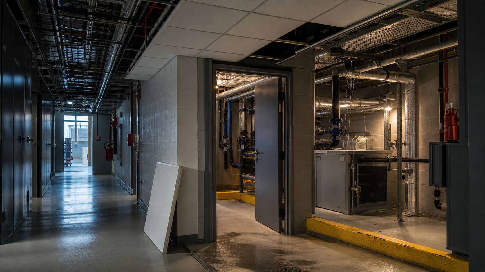

# Drill Day

**The building teaches back.** Drill Day is an open-source facilities-training demo where a learner and an AI agent share the same live 3D building. Walk to an incident, diagnose it from the scene, choose the safe intervention, and watch every human, scene, and agent action land in one audit trail.



[Live demo](https://drill-day.vercel.app) · [source](https://github.com/mrestrepoj10/drill-day) · [WebMCP Challenge notes](docs/CHALLENGE.md) · [under-three-minute demo script](docs/DEMO_SCRIPT.md)

## The flagship drill

It is 07:42 at Northgate Data & Logistics. Water is coming through a ceiling tile in Room 214. The learner must:

1. Navigate to Room 214 on foot, using the building signs.
2. Identify the split chilled-water drop above the fan coil.
3. Isolate the first-floor branch without shutting down cooling for the server room or the entire building.

The model marks deterministic answers. The agent explains why a near miss was reasonable and what it would cost on a real site. Search, camera shortcuts, and manual advancement are disabled when they would give away the exercise.

## Why WebMCP matters here

The page exposes 13 native site tools through `document.modelContext`. They operate on the exact scene and session the learner is viewing—no copied state and no separate backend.

| Capability | Site tools |
| --- | --- |
| Read live context | `training_get_session`, `training_list_elements`, `training_inspect_element`, `training_trace_system` |
| Ground the camera | `training_locate_element`, `training_set_view`, `training_cut_section` |
| Teach in the moment | `training_give_hint`, `training_say`, `training_advance`, `training_replay` |
| Create training | `training_start_mission`, `training_author_mission` |

Every tool has a constrained JSON Schema, a human-readable title and description, truthful read-only annotations, and an async executor. Mission-level allow lists enforce instructional guardrails. An agent can inspect a valve while being refused permission to locate it.

If the browser does not yet implement WebMCP, a faithful same-document polyfill keeps the demo and manual tool console usable. It cannot provide out-of-page discovery; the UI says so explicitly.

## Scene and interaction

- Autodesk Viewer 7 Scene API builds the model at runtime, so the demo needs no APS token or uploaded design file.
- Stable training IDs stay separate from Scene API instance IDs.
- Exact hit testing is backed by a screen-space semantic fallback for small valves, with an occlusion guard to prevent through-wall answers.
- Revealed labels are accessible buttons, while drag distance and pointer identity prevent BimWalk gestures from becoming accidental selections.
- The floor plan reports live position but cannot teleport a learner past a navigation objective.
- The activity log merges agent calls, learner selections, guardrails, coaching, and room-entry events.

The incident briefing image was generated specifically for this project with GPT Image and used as visual art direction for the Scene API treatment: dark services, open ceiling grid, route markings, operational signage, leak context, and wet-floor details. See [asset provenance](public/media/README.md).

## Run locally

Requirements: Node.js 20.9+ and pnpm 10.

```bash
pnpm install
pnpm dev
```

Open [http://localhost:3000](http://localhost:3000). Localhost is treated as a secure context by modern browsers. A WebMCP-capable agentic browser is needed for external tool discovery; the built-in console works everywhere.

Verify the release build:

```bash
pnpm verify
```

No environment variables, API keys, or Autodesk credentials are required.

## Architecture

```text
src/
├── app/                         Next.js 16 App Router shell
├── components/training/         mission UI, scene, plan, flagship flow
├── core/viewer/                 tokenless Autodesk Viewer bootstrap
├── core/scene-render/           Scene API geometry, materials, picking
├── core/viewer-training/        mission runtime and deterministic evaluator
├── core/webmcp/                 native registration, polyfill, call journal
└── lib/training/                facility graph, missions, site tools
```

The app is intentionally client-side and statically deployable. The Autodesk runtime is loaded from Autodesk's official Viewer CDN and is not included in this repository.

## Challenge development disclosure

An earlier training proof of concept existed in the private/local `layer0` workspace. This repository is the standalone challenge release created after August 25, 2026. Challenge work includes the Next.js 16 extraction, reauthored product shell, generated visual brief, environmental Scene API pass, signage, unified activity log, WebMCP schema hardening and guardrails, selection tolerance, pointer safety, walk lifecycle fixes, responsive layout, documentation, and deployment packaging. Commit history in this repository provides the dated record.

## Contributing

Issues and pull requests are welcome. Please keep mission answers deterministic, preserve stable element IDs, and run `pnpm verify` before opening a pull request.

## License and third parties

Project source is available under the [MIT License](LICENSE). See [third-party notices](THIRD_PARTY_NOTICES.md) for dependency licenses, the WebMCP attribution, the Autodesk runtime exclusion, and generated-image provenance.
